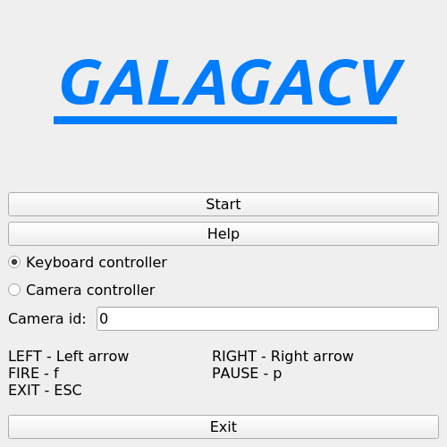
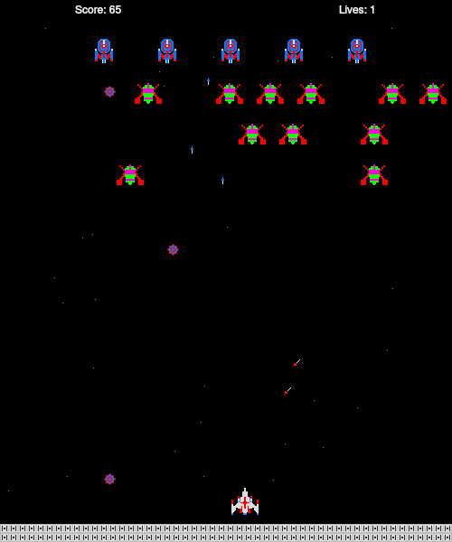

# galagacv
### Intro
Galagacv is a game which has been created with the choice of control, using a keyboard or gesture-controlled movement.

Main menu of the game            |  Game process
:-------------------------------:|:-------------------------:
                |  

### Installation
Install development tools: CMake, OpenCV, Qt5
- Debian:
```bash
sudo apt-get install qtbase5-dev libopencv-dev cmake
```
- ArchLinux:
```bash
sudo pacman -S qt5-base opencv cmake
```

- For Windows:
  - Install cmake pre-compiled binaries available on the Download page: https://cmake.org/download/
  - Offline installers for Qt5: https://www.qt.io/offline-installers
  - Here is an instruction how to install OpenCV for Windows: https://docs.opencv.org/4.0.1/d3/d52/tutorial_windows_install.html

And after that, execute commands:
```bash
$ cmake .
$ make
```
